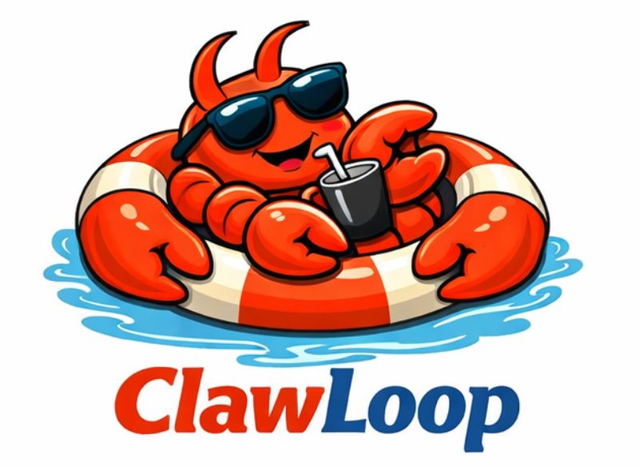
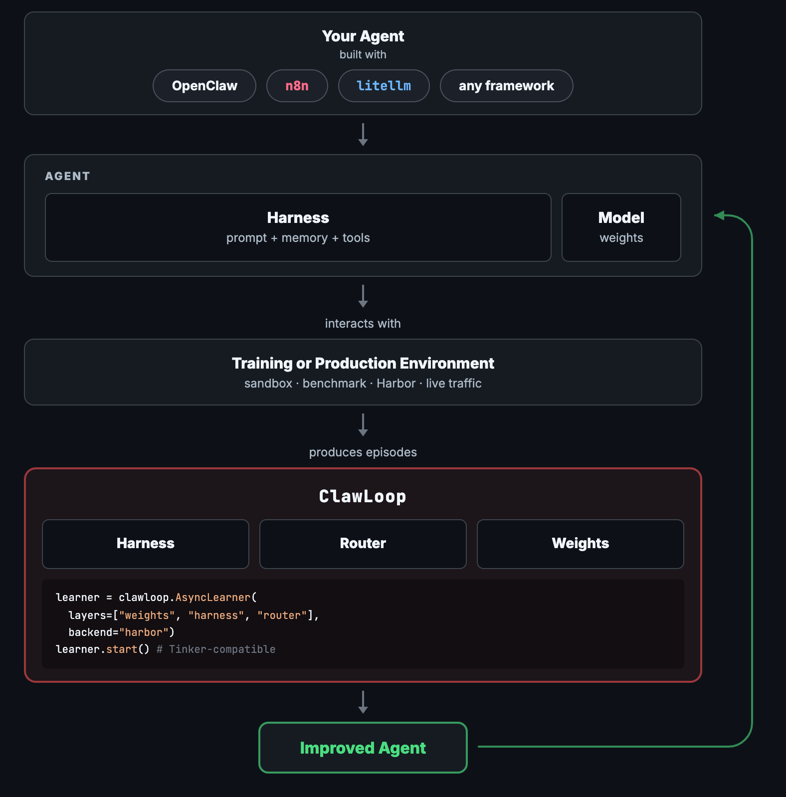

<p align="center">
  
</p>

# ClawLoop — Agents That Learn from Experience

[](LICENSE)
[](https://github.com/aganthos/clawloop/actions/workflows/ci.yml)
[](https://www.python.org/downloads/)

Your AI agents run, fail, and forget. ClawLoop closes the loop: it observes
agent-environment interactions, learns from them, and feeds improvements back
into the agent. Three learning layers — **harness**, **router**, **weights** —
all following the same protocol.

<p align="center">
  
</p>

## Install

Requires Python 3.12 or 3.13.

```bash
git clone https://github.com/aganthos/clawloop
cd clawloop
uv sync                # installs all deps from uv.lock, creates .venv automatically
```

For weight training (GPU):
```bash
git submodule update --init clawloop/skyrl
uv sync --extra taubench
```

## Try It in 10 Seconds

No API keys. No setup. Just run:

```bash
uv run clawloop demo math --dry-run
```

or as a module:

```bash
uv run python -m clawloop.demo_math --dry-run
```

or via the examples shim (also works from a clone):

```bash
uv run python examples/demo_math.py --dry-run
```

```
Reward curve per iteration:
  Iter 1: 0.6000  ########################
  Iter 2: 0.8000  ################################
  Iter 3: 1.0000  ########################################
  ...
```

The agent starts with mistakes, the reflector analyzes failures, learns
strategies, and injects them into the system prompt. Rewards climb toward
1.0 as the playbook grows. *(This example is complete — run it as-is.
Output varies slightly between runs.)*

## What the Code Looks Like

**Add learning to an existing agent (2 lines):**

```python
import clawloop

wrapped = clawloop.wrap(your_llm_client, collector)
result = wrapped.complete(messages)  # transparently captures traces for learning
```

**Run a full learning loop:**

```python
from clawloop import ClawLoopAgent
from clawloop.environments.math import MathEnvironment

agent = ClawLoopAgent(
    task_client=task_llm,
    reflector_client=reflector_llm,
    base_system_prompt="You are a math solver.",
)
results = agent.learn(MathEnvironment(), iterations=10, episodes_per_iter=5)
# results["rewards"] → [0.4, 0.6, 0.8, 1.0, ...]
```

**Config-driven training (no code):**

```bash
uv run python examples/train_runner.py examples/configs/math_harness.json
```

## Choose Your Integration Path

| Example type | Start here | What it shows |
|---|---|---|
| Harness: no-key math learning loop | `uv run clawloop demo math --dry-run` | ClawLoopAgent learns from math episodes without API keys |
| Harness: package/module demo entry points | `uv run python -m clawloop.demo_math --dry-run` or [`examples/demo_math.py`](examples/demo_math.py) | Same math demo from an installed package or source clone |
| Playbook internals walkthrough | `uv run python examples/playbook_demo.py --dry-run` | `forward_backward`, `optim_step`, entry scoring, structured skills |
| Workflow: n8n webhook integration | [`examples/n8n/`](examples/n8n/) | Workflow platform sends traces to clawloop-server; no Python in the workflow |
| Harness benchmarks: config-driven runner | `uv run python examples/train_runner.py examples/configs/math_harness.json` | Math, CRMArena, Harbor BFCL via JSON configs and litellm |
| Proxy harness: zero-code-change OpenClaw | `uv run python examples/openclaw_demo.py` | Transparent proxy captures traces and injects learned skills |
| Remote OpenClaw: SSH-connected proxy harness | `uv run python examples/openclaw_demo_remote.py --host YOUR_HOST ...` | Learn from a remote OpenClaw instance and compare before/after |
| Weights: SkyRL/Tinker training recipes | [`examples/recipes/`](examples/recipes/) | GRPO, PPO, and fine-tuning recipes for GPU training |

See [`examples/README.md`](examples/README.md) for details on each path.

## How It Works

**The loop.** An agent interacts with an environment (or production traffic).
ClawLoop collects episodes — structured traces of messages, tool calls,
and rewards. Learning layers process these episodes and update the agent.
Repeat.

**Harness layer.** An LLM reflector reads execution traces, diagnoses
failures, and extracts reusable strategies into a playbook. Playbook entries
are injected into the system prompt and accumulate helpful/harmful scores
over time. Bad strategies decay and get pruned; good ones persist.

**Router layer.** Optimizes which model handles which query type. A
complexity scorer maps queries to tiers, and the router adjusts based on
reward/cost efficiency across episodes.

**Weights layer.** Trains model weights — LoRA, full fine-tuning, SFT,
GRPO, PPO, and more — delegating to [SkyRL/Tinker](https://github.com/NovaSky-AI/SkyRL)
for the heavy lifting.

**Unified protocol.** All three layers follow the same two-phase protocol:
`forward_backward()` accumulates updates without mutating state, then
`optim_step()` applies them atomically. If `optim_step` fails on any layer,
all layers roll back together.

## Environments

| env_type | What it does | Needs |
|----------|-------------|-------|
| `math` | Built-in arithmetic and competition math | LLM API |
| `harbor` | [Harbor](https://harborframework.com/) sandboxed agent tasks (BFCL, etc.) | Docker + LLM API |
| `entropic` | [CRMArenaPro](https://github.com/salesforce/CRMArena) A2A benchmark | Entropic bench + LLM API |
| `openclaw` | Transparent proxy — captures traces + injects playbook skills | Node.js + OpenAI-compatible Chat Completions endpoint |

## LLM Providers

ClawLoop uses [litellm](https://docs.litellm.ai/) — any provider works:

```json
{"model": "anthropic/claude-haiku-4-5-20251001"}
{"model": "openai/gpt-5-nano"}
{"model": "gemini/gemini-3.1-flash-lite"}
```

Set the provider's API key as an environment variable (`ANTHROPIC_API_KEY`,
`OPENAI_API_KEY`, `GEMINI_API_KEY`). Or pass `api_key` and `api_base` in the
config for custom endpoints.

<details>
<summary><strong>Architecture</strong></summary>

```
train(config)
  -> validate_config()          # fail fast
  -> build harness + reflector  # prompt layer
  -> build weights backend      # SkyRL/Tinker (if weight mode)
  -> build env adapter          # math / harbor / entropic / openclaw
  -> learning_loop()            # collect episodes, forward_backward, optim_step
```

Environments are pluggable via `ENV_BUILDERS` registry in `clawloop/train.py`.

The learning loop per iteration:
1. Collect episodes from the environment adapter
2. Distribute episodes to all active layers as `Datum` objects
3. `forward_backward()` on each layer — accumulate updates, no state mutation
4. `optim_step()` on each layer — atomically apply, with cross-layer rollback on failure
5. Recompute `StateID` (content-addressed hash across all layers)

</details>

<details>
<summary><strong>Adding a New Environment</strong></summary>

Write a builder function that returns `(adapter, tasks)`:

```python
# clawloop/train.py
def _build_my_env(config, llm_clients):
    adapter = MyAdapter(...)  # must implement run_episode(task, agent_state) -> Episode
    tasks = ["task1", "task2"]
    return adapter, tasks

ENV_BUILDERS["my_env"] = _build_my_env
```

Your adapter's `run_episode` must return an `Episode` with messages, steps,
and an `EpisodeSummary` containing reward signals. See `clawloop/environments/math.py`
(`MathAdapter`) for a minimal example (~80 lines).

</details>

<details>
<summary><strong>Limitations</strong></summary>

- **`mode="full"`** (simultaneous harness + weight training) is disabled.
  The on-policy boundary after harness updates needs rework for GRPO advantage
  computation. Use `weight` and `harness_learning` separately for now.
- **Episode construction is manual.** There is no `ProblemEnv` base class yet.
  New environments must build `Episode` objects directly. A higher-level
  abstraction (like Tinker cookbook's `ProblemEnv`) is planned.

</details>

## Enterprise

ClawLoop Enterprise adds premium learning backends and managed
infrastructure on top of the community edition.

- **Premium evolution backends** — broader search over prompts, playbooks,
  and agent configurations than the community `LocalEvolver`
- **Persistent playbooks** — versioned storage with rollback so learned
  strategies survive restarts
- **Managed training infrastructure** — hosted compute for weight training
  without self-hosting GPUs
- **Logging & lineage** — episode archive with provenance tracking

Contact [info@aganthos.com](mailto:info@aganthos.com) to learn more.

## License

ClawLoop is licensed under the [Business Source License 1.1](LICENSE) with
an Additional Use Grant.

**What you can always do**, free and without restriction:
- Use ClawLoop for development, testing, security review, and academic research
- Copy, modify, and redistribute the source code
- Use ClawLoop in production if your organization has less than $10M in
  annual revenue

**What requires a commercial license:**
- Production use by organizations with $10M+ annual revenue
- Building a competing agent-improvement or model-optimization service

**On April 1, 2030**, each version converts automatically to the
[Apache License 2.0](https://www.apache.org/licenses/LICENSE-2.0) —
permissive, forever, no strings.

For commercial licensing, contact [info@aganthos.com](mailto:info@aganthos.com).
